<h1 align = "center">Testing Results</h1>

# Code Testing

## W3C HTML Validator

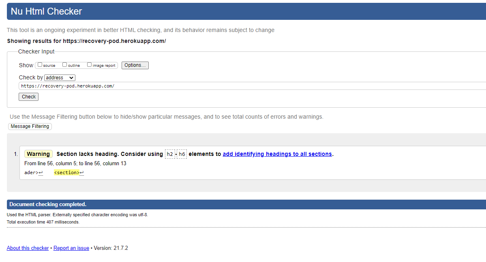

## W3C CSS Validator

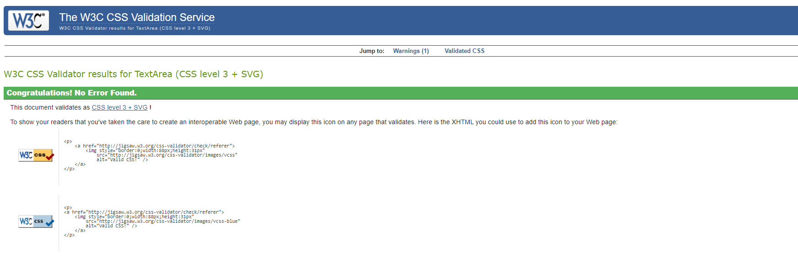

## JSHint Validator

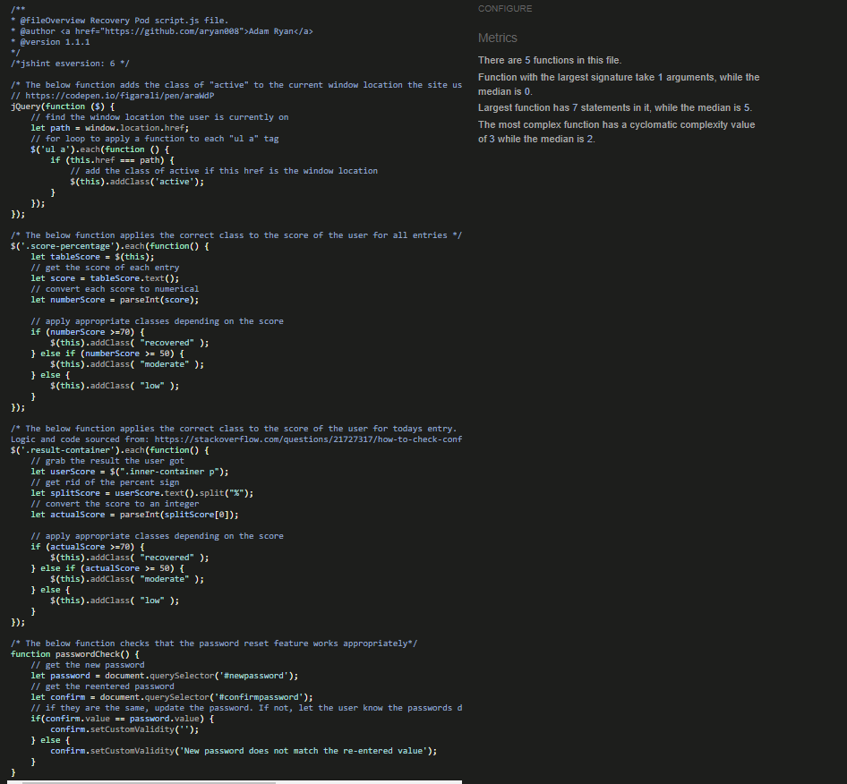

## PEP8 Online Validator

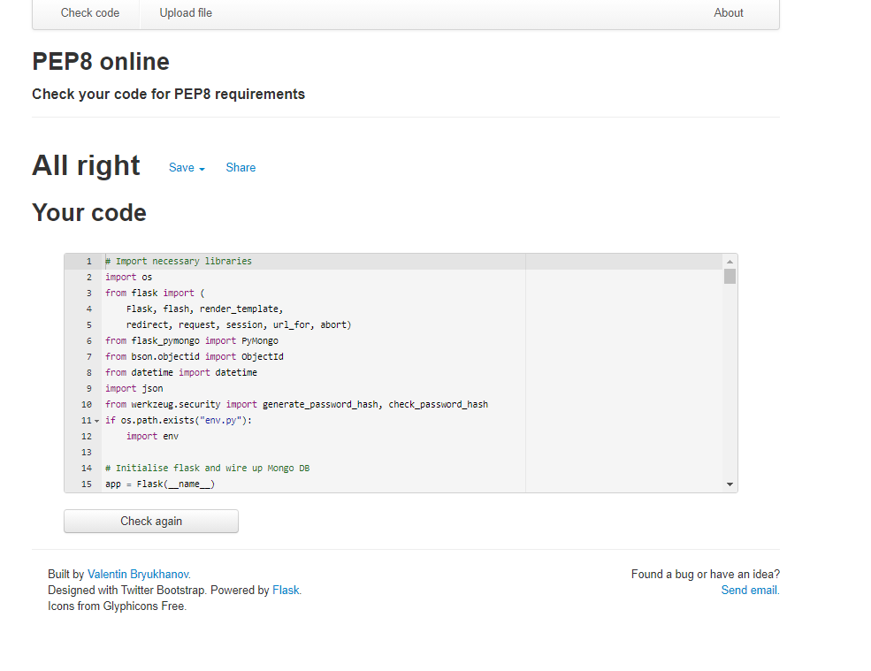

## GTMetrix Validator

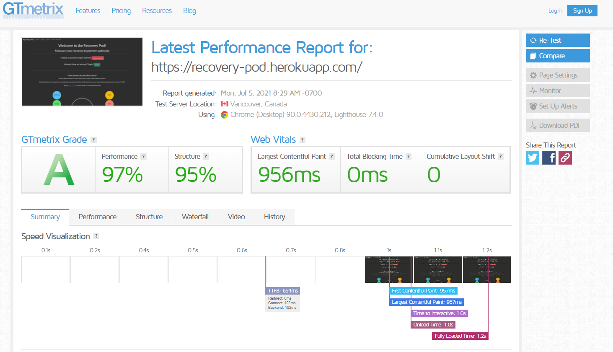

# Accessibility Testing

## Google Lighthouse

### Mobile

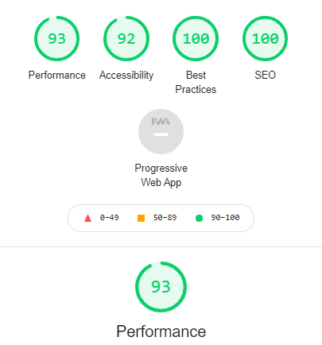

### Desktop

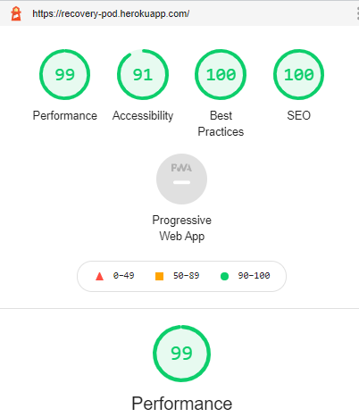

# Responsive Testing

## Google's Mobile Friendly Tester

1) 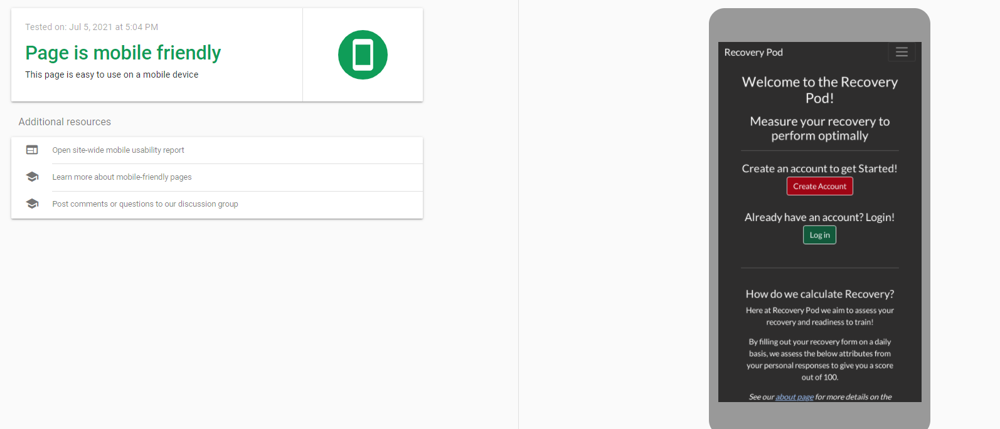
2) 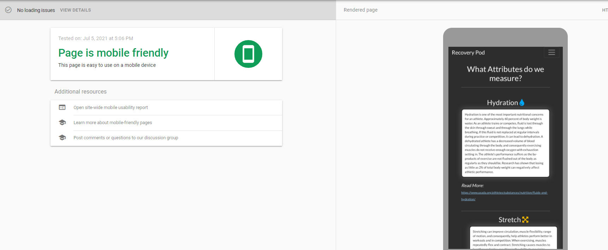
3) 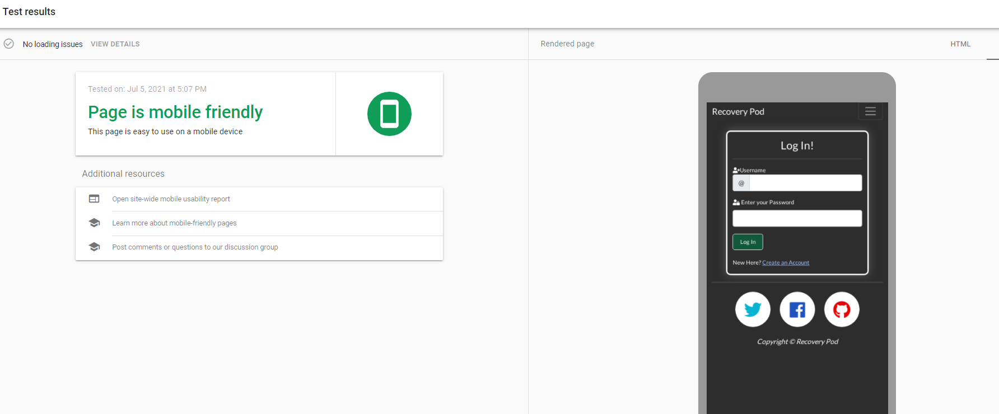
4) 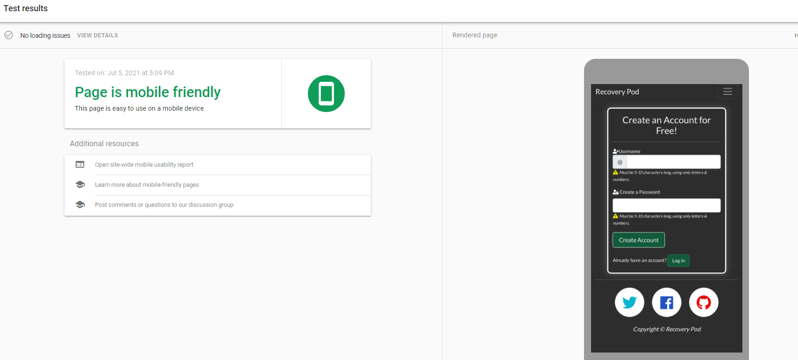

## Responsinator

1) 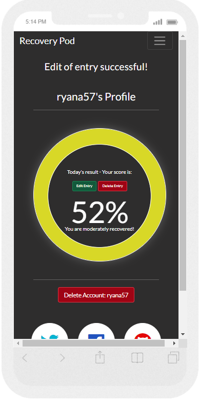
2) 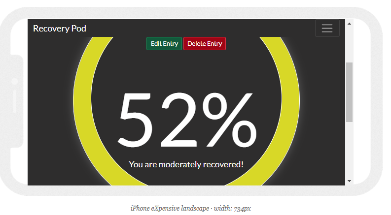
3) 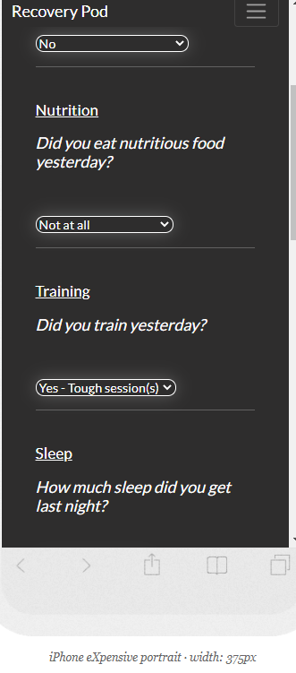
4) 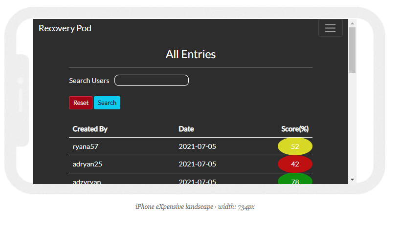

